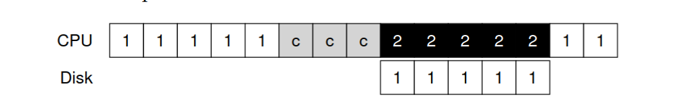

# I/O devices
**why I/O is important**
- A program without an input always produces the same input .
- A program without an output , what is the purpose of running it 
 
 ### Canonical Devices 
 A canonical device is a conceptual model used in operating systems to illustrate the standard components and interfaces of hardware devices. It consists of two key parts:

1. **Hardware Interface:** The standardized protocol and control registers that allow the operating system to interact with the device. This includes:

* Command registers :  to tell , the device to perform a certain tasks
* Status registers : which can read the current status of device
* Data registers or buffers : to pass data to the device or to get data from the device

By reading or writing this registers OS can control the device behavior 


2. **Internal Implementation:** The device-specific hardware and firmware that implements the actual functionality, which may include:

 * Specialized chips and circuits
 * Device firmware (software embedded in the hardware)
 * Internal processors and memory
 * Implementation-specific logic

 ### Steps in Protocol
 1. the OS waits until the device is ready to receive a command by repeatedly reading the status register;we call this polling the device (basically, just asking it what is going on)
 ```
 Wait for Readiness of device
 While (STATUS == BUSY)
  ; // Polling loop waiting until device is free
 ```
 2. the OS sends some data down to the data register; one can imagine that if this were a disk, for example, that multiple writes would need to take place to transfer a disk block (say 4KB) to the device.
 ```
Transfer Data:
Write data to DATA register
 ```
3. The OS writes a command to the command register; doing so implicitly lets the device know that
both the data is present and that it should begin working on the command
```
Issue Command:
Write command to COMMAND register
```
4. The OS waits for the device to finish by again polling it in a loop, waiting to see if it is finished (it may then get an error code to indicate success or failure).
```
Wait for Completion:
While (STATUS == BUSY); // Polling loop waiting until device finishes
```
**Key Limitations:**

* Polling Inefficiency: The CPU continuously checks device status, wasting processing time instead of doing useful work
* CPU-Intensive Data Transfer: Using the main CPU for data movement (programmed I/O) is inefficient for large transfers
* Blocking Operation: The entire process blocks while waiting for the device to complete

## Other Optimization Models/technique  
### Using interrupt [ Lowering CPU Overhead ]
**Problem with Canonical Devices**
it wastes the CPU cycles ,by continusly checking the status register to write the commands on command register


**Solution**
1. Instead of polling ,the os put the calling process to sleep , and context switch to other process/Task . when the device done the I/O operation ,it sends a hardware interrupt ,the ISR (interrupt service routine) or interrupt handler cause the CPU to jump to the OS to handle the interrput.and wake the process waiting for I/O      


two-phased approach/Hybrid approuch : do polling foe a while , then use this approuch . it will perform better 
2. Coalscing(merging entities , like free segments/blocks of memory into one segment/block), a device which needs to raise an interrupt first waits for a bit before delivering the interrupt to the CPU. While waiting, other requests may soon complete, and thus multiple interrupts can be coalesced into a single interrupt delivery, thus lowering the overhead of interrupt processing.

### DMA [ Efficient Data Movement ]
**Problem**
1.  when using programmed I/O (PIO) to transfer a large chunk of data to a device, the CPU is once again overburdened, and wastes lot of CPU cycles 
2. Process 1 is running and then wishes to write some data to the disk. It then initiates the I/O, which must copy the data from memory to the device explicitly, one word at a time (marked c in the diagram).
When the copy is complete, the I/O begins on the disk and the CPU can finally be used for something else.


**Sloution**
1. A DMA engine is essentially a specific device within the system that can orchestrated transfer ( autometed & centrally managed movement of data) b/w device and main memory, without CPU involvement

**Working of DMA**
1. CPU programs DMA controller registers
2. DMA controller requests bus access (bus mastering)
3. CPU grants bus control via bus arbiter
4. DMA controller drives memory addresses and control signals
5. Data moves without CPU handling each byte
6. DMA controller increments addresses, decrements counters
7. Transfer completes, DMA interrupts CPU

To transfer data to the device, for example, the OS would program the DMA engine by telling it where the data lives in memory, how much data to copy, and which device to send it to. At that
point, the OS is done with the transfer and can proceed with other work. When the DMA is complete, the DMA controller raises an interrupt, and the OS thus knows the transfer is complete.

**Example:**

 the copying of data is now handled by the DMA controller. Because the CPU is free during that time, the OS
can do something else, here choosing to run Process 2. Process 2 thus gets to use more CPU before Process 1 runs again.
